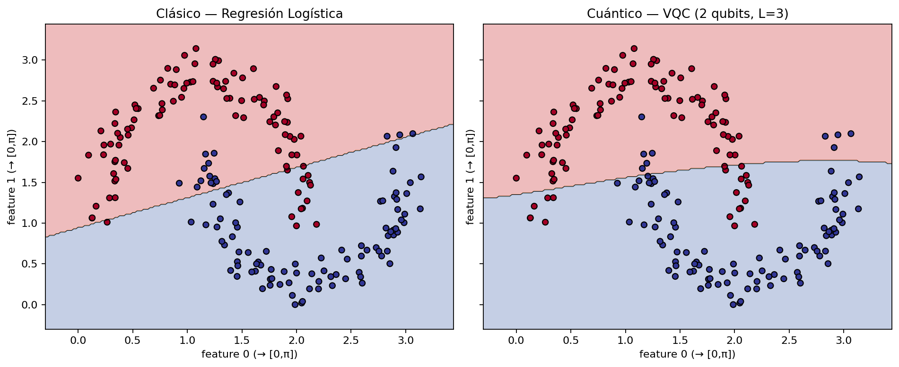
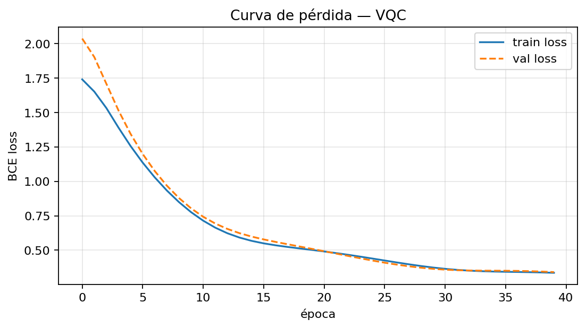

# Clasificador Cuántico Variacional (VQC)


Clasificador híbrido cuántico-clásico con 2 qubits, angle encoding y ansatz hardware-efficient. Simulador numpy por defecto (cero fricción); Q# opcional con validación cruzada.

## Arquitectura — flujo extremo a extremo

```
Datos clásicos → Normalización [0, π] → Ry(xᵢ) angle encoding (2 qubits)
  → Ansatz hardware-efficient (L capas: Ry(θ)Rz(φ) + CNOT)
  → ⟨Z₀⟩ ∈ [-1,1] → p=(1+⟨Z⟩)/2 → BCE
  → parameter-shift rule → Adam/SGD → loop
```

**El circuito es una capa dentro de un ciclo clásico.** Q# (cuando se usa) solo ejecuta el circuito; Python orquesta dataset, pérdida, gradientes y optimización. Eso es lo que hace híbrido al modelo.

## Instalación

```bash
# base — corre en cualquier laptop, sin Azure ni GPU
pip install .

# con validación Q# (opcional)
pip install .[quantum]

# desarrollo
pip install .[dev]
```

Datasets sintéticos (`moons`) y `iris` se generan en memoria vía `scikit-learn` — no hay `data/raw/` que versionar. La reproducibilidad viene de semillas fijas, no de CSVs.

## Uso rápido

```python
from src.data.datasets import get_dataset
from src.data.preprocessing import normalize_to_pi, train_test_split_stratified
from src.classical.baseline import train_logistic_regression, evaluate
from src.training.loop import train, predict_proba
from src.training.loss import accuracy_from_probs

X_raw, y = get_dataset("moons", n_samples=200, noise=0.1, random_state=42)  # default moons
# X_raw, y = get_dataset("iris")  # alternativa linealmente separable
X, _ = normalize_to_pi(X_raw)
X_train, X_test, y_train, y_test = train_test_split_stratified(X, y)

clf = train_logistic_regression(X_train, y_train)
print(evaluate(clf, X_test, y_test))  # baseline

history = train(X_train, y_train, X_val=X_test, y_val=y_test,
                n_layers=3, lr=0.05, epochs=60, optimizer="adam")
print(accuracy_from_probs(predict_proba(X_test, history["params_final"], 3), y_test))
```

Notebook comparativo: `notebooks/01_comparativo_vqc_vs_clasico.ipynb` (outputs limpiados vía `nbstripout` + `.gitattributes:1`).

## Diseño por capas

| Capa | Detalle |
|---|---|
| **Codificación** | `Ry(xᵢ)` por qubit — angle encoding estándar, 1 feature por qubit |
| **Ansatz** | Hardware-efficient: por capa `Ry(θ)Rz(φ)` por qubit + `CNOT(0→1)`. Parámetros `2×n×L` → 12 con 2 qubits y L=3 (vs 3 de regresión logística) |
| **Medición** | `⟨Z₀⟩` en `[-1,1]` → `p=(1+⟨Z⟩)/2` |
| **Pérdida** | Binary cross-entropy |
| **Gradientes** | Parameter-shift rule `∂⟨Z⟩/∂θ = (⟨Z⟩(θ+π/2)-⟨Z⟩(θ-π/2))/2` + regla de la cadena a BCE. Exacto con 12 params; SPSA documentado como alternativa para hardware ruidoso |
| **Optimizador** | `optimizer="adam"` (default, navega plateaus mejor) o `"sgd"` — comparar ambos es un punto de análisis |

## Doble backend y validación cruzada

- `src/quantum/numpy_backend/` — matrices unitarias + producto tensorial, 4 amplitudes, simulación exacta.
- `src/quantum/qsharp_backend/Circuit.qs` — mismo circuito en Q#.
- `src/quantum_circuit.py:8` — fachada `circuit_expectation(..., backend="numpy"|"qsharp")`. Default `numpy`.
- `tests/test_circuit_parity.py` — compara ambos backends en puntos aleatorios (`|numpy-qsharp|<1e-6`). Se salta si `qsharp` no está instalado. **No es adorno: es prueba de correctitud.**

En CI el job `parity-qsharp` corre con `continue-on-error: true` (`.github/workflows/tests.yml:22`).

## Resultados

Fronteras de decisión (moons, `results/fronteras.png`):



Curva de pérdida (`results/loss_curve.png`):



| Modelo | Accuracy (moons, test 20%) | Params |
|---|---|---|
| Regresión logística | ~0.85 | 3 |
| VQC (2 qubits, L=3, Adam 40 épocas) | ~0.75-0.85* | 12 |

\* varía con semilla/ruido; lo clásico suele ganar en este régimen — ver limitaciones.

## Limitaciones honestas

- **Barren plateaus:** con más capas el gradiente se aplana y la curva se estanca — no es bug, es fenómeno documentado. Si lo ves, dilo.
- **Ventaja cuántica:** para 2 features lo clásico gana en exactitud y velocidad. La pregunta interesante no es "¿ganó lo cuántico?" sino "¿bajo qué condiciones podría y por qué no hoy?".
- **Simulador vs hardware:** 4 amplitudes caben en cualquier laptop; hardware real añadiría ruido y costo de shots.

## Estructura

```
src/
  data/               # datasets (moons default, iris) + normalización [0,π]
  classical/          # baseline logístico/SVM
  quantum/
    numpy_backend/    # gates.py + state.py
    qsharp_backend/   # Circuit.qs
  quantum_circuit.py  # fachada backend
  training/           # loss, gradients (parameter-shift), loop (adam/sgd)
  visualization/      # fronteras + curva
notebooks/            # comparativo (nbstripout via .gitattributes)
results/              # PNGs finales para README
tests/                # pytest, paridad qsharp opcional
```

## Tests

```bash
pytest -v              # base (9 passed, 1 skipped sin qsharp)
pytest -v tests/test_circuit_parity.py  # requiere pip install .[quantum]
```

CI: `.github/workflows/tests.yml` en cada push; badge arriba.

## Jupyter — nbstripout

`.gitattributes:1` (`*.ipynb filter=nbstripout`) asegura que los notebooks se versionen sin outputs pesados. Ejecuta una vez por clon:

```bash
nbstripout --install
```

Los `results/*.png` sí se versionan para que el README se vea sin abrir el notebook.
